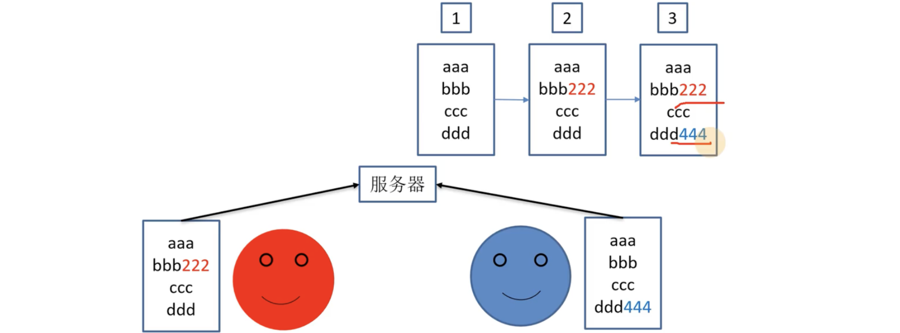
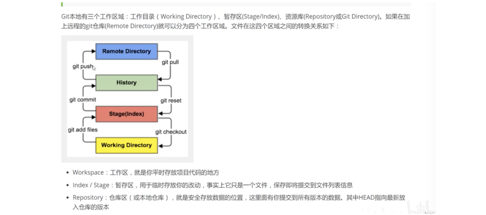
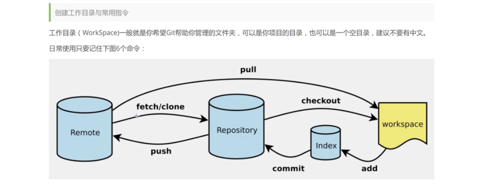
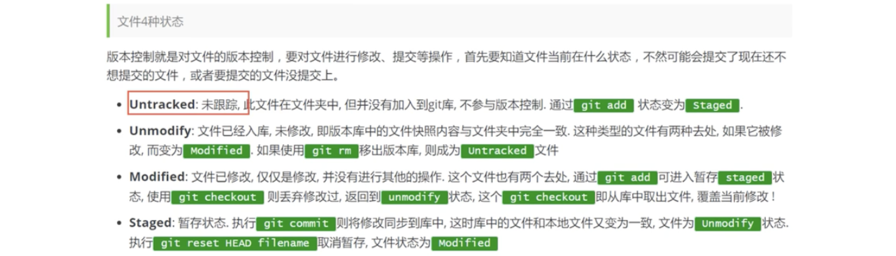
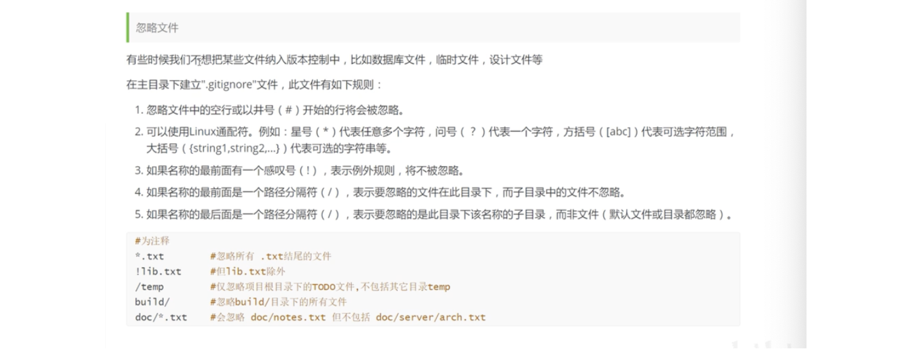

### git的介绍

分布式版本控制工具 vs 集中式版本控制工具

**什么是版本控制？**版本迭代

是一种记录文件内容变化，方便查看项目修改记录过程

多人开发，协同开发，统计工作量，并行开发，提高开发效率

从个人开发到团队合作

**本地版本控制**

就在本地修改自己的文档，多次迭代版本，适合个人使用

**集中式版本控制工具**

开发人员统一在中央服务器进行版本修改，容易中央服务器单点故障

多个人提交发生冲突，需要权衡进行选择

**分布式版本控制工具**

每个电脑都有自己的版本控制中心，每个人都拥有全部的代码

### git的核心

基本理论 基于开放案例 详细讲解git的常见命令 

三个工作区：工作目录、暂存区、资源库（本地repository）、远程区

远程仓库：代码托管的服务器

### git项目搭建/文件管理

1. 本地初始化项目 git init/克隆远程的一个仓库 git clone [url]

### git的分支

分支特性、分支创建、分支转换、分支合并、代码合并冲突

### github

创建远程仓库

代码推送 push

代码拉取 pull

代码克隆 clone

ssh免密登陆

idea继承github

### gitee码云

国内版本的github

创建远程库

idea集成gitee码云

码云链接github，进行代码的复制与迁移

### gitlab

基于局域网的，用于公司内部项目代码管理

[参考B站](https://www.bilibili.com/video/BV1FE411P7B3/?spm_id_from=333.337.search-card.all.click&vd_source=084728306193898208d80f40ece2975b)
