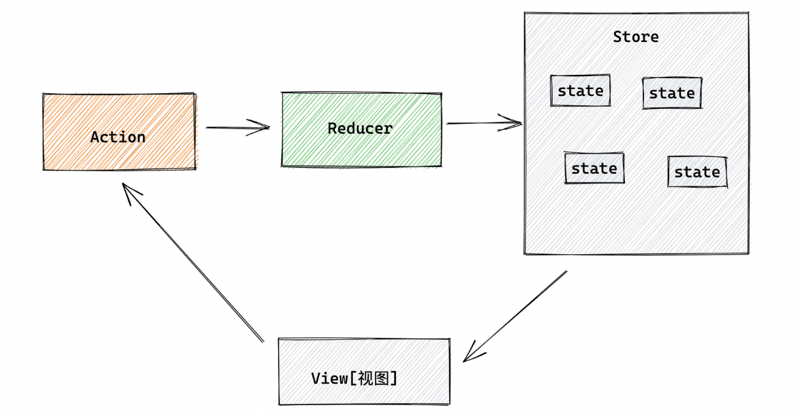

### :pen: 面试问题

#### 什么是React？

> React是facebook开发的一个用于构建用户界面的开源javasctipt库（采用的是jsx语法），能够帮助用户更快的构建交互式UI
>
> **组件化**
>
> + 类组件：组件的抽象可以增加复用能力和提高可维护性 
>
>   经典组件/ES5组件
>
>   > + 状态：存储在this.state中，状态是一个可变的对象，状态的变化可以使得react重新渲染页面（this.setState来进行修改状态-需要进行重新渲染，所以需要在this.setState()内部来运行render()函数对组件进行重新渲染）
>   >
>   > + 生命周期方法：挂载/更新/卸载
>   >
>   >   + Constructor 
>   >
>   > + 渲染方法：每个组件必须实现一个render方法，返回一个react元素或者null值
>   >
>   > + props属性：类似于函数的参数，父组件通过props将数据传递给子组件，维护一个单向的数据流
>   >
>   >   + 子组件通过this.prop获取父组件传递过来的消息
>   >
>   >   + 子组件给父组件传递消息，需要采用回调函数的形式进行传递
>   >
>   >     > 父组件中：
>   >     >
>   >     > handleMessage(message) {    console.log(message);  }
>   >     >
>   >     > <ChildComponent onMessage={this.handleMessage} />
>   >     >
>   >     > 子组件中：
>   >     >
>   >     > handleClick() {    this.props.onMessage('Hello, Parent!');  }
>   >     >
>   >     > \<button onClick={this.handleClick}>Click me</button>
>
> + 函数组件
>
>   > 函数组件是一个纯函数，接收一些属性作为输入，返回一个react元素
>   >
>   > + 没有状态，没有实例
>   >
>   > + 通过props形式参数进行数据传递，通过钩子函数维护状态useState()
>   >
>   > + 采用**钩子函数**实现类组件的功能
>   >
>   >   > useState() 维护状态
>   >   >
>   >   > useEffect() 实现副作用，异步操作-异步请求/io操作/事件处理
>   >   >
>   >   > useContext() 使用上下文来实现组件之间共享状态
>   >   >
>   >   > useReducer：react本身不提供状态管理，通常需要引入外部库redux
>
> + 高阶组件
>
>   > 本身是一个函数，接收一个组件作为参数，并返回一个新的组件
>   >
>   > 实际应用：
>   >
>   > + 给表单添加逻辑处理
>   > + 给组件添加日志记录
>   > + 进行条件渲染等等
>
> **单向数据流**
>
> > react使用单向数据流来管理组件之间的数据交互，通过props将数据从父组件传递到子组件
>
> **虚拟DOM**
>
> > react采用虚拟的DOM技术来提高性能和用户体验，虚拟DOM是内存中的数据结构，能够在UI中的组件状态发生变化时快速对比前后的状态，找出差异并只更新需要更新的部分，避免整个页面的重新渲染
> >
> > + diff算法步骤
> >   + 当更新一个组件的时候，首先创建一棵新的dom树
> >   + 比较新树和旧树之间的差异
> >   + 对于两个不同节点，将会被视为不同的树，删除旧节点用新节点替换
> >   + 对于两个相同的节点，更新节点的属性，
> >   + 如果两个相同节点有不同的子节点，react递归的更新其子节点
> >   + 比较完成后，将需要更新的节点打上标记，然后进行实际的DOM操作，更新程序的应用界面
>
> **生态丰富**
>
> + redux/mobx：提供状态管理
> + router：提供但页面应用的路由
> + axios：提供一个发起http请求的js库
> + material-ui：构建react组件的ui组件库
> + styled components：用于构建样式化react组件库
>
> **重要概念：**组件化、单向数据流（组件通信）、状态、钩子函数、生命周期、受控与非受控等

#### React的特点？

> **组件化：**react通过组件化方式来构建UI，将UI拆分成为多个独立的部分，每个部分可以独立的进行独立的开发、测试和维护
>
> **虚拟DOM：**react采用虚拟的DOM技术来提高性能和用户体验，虚拟DOM是内存中的数据结构，能够在UI中的组件状态发生变化时快速对比前后的状态，找出差异并只更新需要更新的部分，避免整个页面的重新渲染
>
> **单向数据流：**react使用单向数据流来管理组件之间的数据交互，通过props将数据从父组件传递到子组件
>
> **生态丰富：**react生态系统丰富，有大量的第三方的库和插件，如react router用于构建但页面应用，redux用于状态管理，react native用于构建原生的移动应用

#### 虚拟DOM与真实DOM？

> DOM是对结构化文本的抽象，将html文档抽象为一棵树，每个元素都是树中的一个节点，对树的操作相当于对文档进行修改
>
> **真实的DOM**是html文档对应的抽象树（每次操作会触发浏览器的的回流与重绘）
>
> **虚拟DOM**是为了避免真实DOM树频繁的更新，影响性能（每次操作会触发浏览器的的回流与重绘），通过js的对象模拟真实DOM中的节点；当数据进行更新的时候，通过先对虚拟的DOM进行修改，最后一次性更新到真实的DOM上，降低频繁对DOM操作带来的巨大开销
>
> 每次react的组件的状态发生变化的时候，react会创建一棵新的虚拟DOM树，并与之前的虚拟DOM树进行对比，找出两者之间的差异，然后将差异汇总并更新到真实的DOM树上

#### Diff算法

> 当react中组件的状态发生变化的时候，react会创建出一棵新的虚拟DOM树，与旧的虚拟DOM树进行对比，步骤如下：
>
> 1. 对比根节点是否相同，如果不同，更新整棵树；否则继续对比子节点
> 2. 根据一下特殊规则来决定子树是否需要更新。比如新旧节点的key属性相同，则表示同一节点，可以直接复用旧节点；如果新旧节点的type类型不同，那么它们表示不同类型的节点，需要进行替换，如果新旧节点的type和key树属性都相同，但是props不同，则需要更新
> 3. diff算法会遍历新旧DOM树中的所有子节点，如果新节点多于旧节点则插入，如果旧节点多于新节点则剔除
> 4. diff算法对属性不同的节点进行更新，如果旧节点没有某个属性则添加，如果新节点没有某个属性则剔除
> 5. 最后，diff算法将所有更新的差异记录下来，进行批量的更新
>
> 采用深度优先遍历算法，因为广度优先可能导致组件的生命周期时序错乱

#### state属性？

> 类内部的自身的属性，是react的核心
>
> 可以讲react看成一个状态机，通过交互修改状态，然后渲染UI，使得用户界面和数据保持一致
>
> 通过this.state访问，使用this.setState()更新类组件的状态，执行该函数，组件会重新执行一遍render函数

#### props属性？

> 将父组件的数据传递给子组件的参数（类似函数的形式参数）
>
> 用户维护单向的数据流

#### refs属性？

> 可用于**获取DOM节点或者react元素实例**的工具，允许用户访问DOM节点或者在render方法中创建react元素 
>
> 两种方式的主要区别是 `createRef()` 是在类组件中使用，而 `useRef()` 是在函数组件中使用。
>
> 另一个区别是，`useRef()` 返回的是一个可变的 ref 对象（返回同一个引用），而 `createRef()` 返回的是一个不可变的 ref 对象（返回一个新的引用）。

#### key值？

> 用于唯一标识虚拟DOM元素，方便在使用diff算法中快速对比变化的节点，提高程序应用性能

#### 什么是jsx？

> 对js语法的拓展，JavaScript XML简写，利用babel将jsx语法转化为js

#### 什么是钩子函数/使用有哪些限制？[阮一峰老师博客](https://www.ruanyifeng.com/blog/2019/09/react-hooks.html)

> **类组件缺点**
>
> 类组件是react最早的组成形式，通过继承React.Component来创建，虽然现在react类组件仍然是核心特性之一，但是有很多缺点：
>
> 1. **代码冗长：**实现相同功能比函数组件需要更多的代码
> 2. **代码复杂：**类组件中**生命周期的方法**和**状态逻辑**使得维护起来比较麻烦
> 3. **性能问题**：类组件的**this关键字的使用和继承开**销影响性能
>
> **优点：**
>
> 1. 有更多的生命周期方法：是的组件的挂载、更新、卸载比较灵活
>    + 挂载之后执行：发送异步请求等
>    + 更新阶段：获取状态变化的一些参数
>    + 卸载阶段：清楚定时器和释放内存空间
> 2. state和props：使用state和props来管理和控制组件状态，使得组件可以**动态的响应用户操作和其他外部变化**
>
> **组件最好的写法应该是函数，不是类**
>
> react hooks设计目的，就是**加强版函数组件**，完全不使用“类”；hooks的意思就是组件写成纯函数，如果需要**外部功能和副作用**，就把外部代码“钩”进来。
>
> 钩子函数是为了函数引入外部功能，钩子一律使用use前缀命名，便于识别
>
> 1. useState：为函数组件引入状态
> 2. useContext：使组件间可共享状态（跨组件状态传递Provider和Consumer）
> 3. useReducer：React本身不提供状态管理，通常需要引入外部库redux；组件发出的action与状态管理器通信；状态管理器收到action以后，使用reducer函数计算出新的状态
> 4. useEffect：引用具有副作用的操作，常见的就是向服务器请求数据、设置定时器和修改状态等

#### react中函数组件的this问题？

> react的函数组件是一种没有实例的组件，所以也不存在this这一说
>
> 需要对函数组件进行state和props进行访问的时候可以通过参数来访问，或者通过setState将参数勾进函数内部

#### react生命周期

> 1. 初始化渲染阶段（执行constructor函数/render函数）
> 2. 更新阶段（组件更新执行）
> 3. 卸载阶段（组件卸载执行）
>
> React 的生命周期指的是组件从被创建、到更新、再到销毁的整个过程，它被分为三个阶段：
>
> 1. Mounting（挂载）：组件第一次被创建并添加到 DOM 中时的过程。
> 2. Updating（更新）：组件重新渲染并更新到 DOM 中时的过程。
> 3. Unmounting（卸载）：组件从 DOM 中移除时的过程。
>
> 下面是每个阶段的生命周期方法：
>
> **Mounting阶段**
>
> 1. **constructor(props)：组件创建时调用，用于初始化状态和绑定成员函数等操作。**
> 2. static getDerivedStateFromProps(props, state)：静态方法，组件创建和更新时调用，用于根据传入的 props 来更新 state，返回一个新的 state 或者返回 null 表示不需要更新 state。
> 3. **render()：组件创建和更新时调用**，返回 React 元素（JSX）。
> 4. **componentDidMount()：组件被创建并添加到 DOM 中后调用**，可以在这个方法中进行网络请求等操作。
>
> **Updating 阶段**
>
> 1. static getDerivedStateFromProps(props, state)：同上述。
> 2. shouldComponentUpdate(nextProps, nextState)：在组件更新前调用，用于判断是否需要更新组件，返回 true 表示更新组件，返回 false 表示不更新。
> 3. render()：同上述。
> 4. getSnapshotBeforeUpdate(prevProps, prevState)：在 render() 方法执行后，组件更新前调用，用于获取组件更新前的 DOM 状态，返回一个快照（snapshot）。
> 5. **componentDidUpdate(prevProps, prevState, snapshot)：组件更新后调用，**可以在这个方法中进行网络请求等操作。
>
> **Unmounting 阶段**
>
> 1. **componentWillUnmount()：组件卸载时调用**，可以在这个方法中清除定时器、取消网络请求等操作。


#### react中副作用指的是什么？

> 任何影响组件状态的行为，包括但不限于：
>
> 1. 修改组件内部状态（使用 `useState`）
> 2. 发送网络请求（使用 `fetch`、`axios` 等）
> 3. 订阅事件（使用 `addEventListener`）
> 4. 操作 DOM 元素（使用 `document.querySelector` 等）
> 5. 设置定时器（使用 `setTimeout`、`setInterval` 等）
>
> 只用**useEffect**对进行处理


#### 受控组件与非受控组件

> 在 React 中，表单元素（例如 `<input>`、`<textarea>` 和 `<select>`）有两种渲染方式：受控组件和非受控组件。
>
> 1. 受控组件：
>
> 受控组件是由 React 组件负责控制表单元素的值和状态。当用户输入内容时，React 组件会更新组件的状态，并将新的值传递给表单元素。这样，表单元素的值和 React 组件的状态始终保持同步。
>
> 例如，下面的代码展示了一个受控的文本输入框：
>
> ```js
> jsxCopy code
> import React, { useState } from 'react';
> 
> function MyComponent() {
>   const [value, setValue] = useState('');
> 
>   const handleChange = (event) => {
>     setValue(event.target.value);
>   };
> 
>   return (
>     <div>
>       <input type="text" value={value} onChange={handleChange} />
>       <p>The value is: {value}</p>
>     </div>
>   );
> }
> ```
>
> 1. 非受控组件：
>
> 非受控组件是由 DOM 自身管理表单元素的状态。React 组件可以访问表单元素的值，但不能控制其状态。
>
> 例如，下面的代码展示了一个非受控的文本输入框：
>
> ```js
> jsxCopy code
> import React from 'react';
> 
> function MyComponent() {
>   const inputRef = React.createRef();
> 
>   const handleClick = () => {
>     console.log(inputRef.current.value);
>   };
> 
>   return (
>     <div>
>       <input type="text" ref={inputRef} />
>       <button onClick={handleClick}>Get value</button>
>     </div>
>   );
> }
> ```
>
> 受控组件和非受控组件都有各自的优点和缺点。受控组件更加灵活，可以轻松地进行表单验证和处理复杂的表单逻辑。非受控组件则更加简单和直接，适用于一些简单的表单场景。开发者可以根据实际需要选择适合自己的方式。


#### 如何使用模块化代码？

> 使用import和export进行模块化的导入和导出

#### react创建表单？

> 通过this.state处理表单的值，将表单处理统一交由react进行管理

#### 路由

> 路由主要有hash路由模式和history路由模式
>
> hash模式是url中以#号分割的部分
>
> + http://example.com/#/home
>
> + 在hash模式下，**#号后面的部分被浏览器认为是页面内的一个锚点**，不会向服务器发送请求，通过js监听浏览器的hashchange事件，根据url中的hash值来切换页面的内容，实现单页面应用
>
>   ```html
>   <h2>
>     <a href="#div1">to div1</a>
>     <a href="#div2">to div2</a>
>     <a href="#div3">to div3</a>
>   </h2>
>   <div id="div1">div1</div>
>   <div id="div2">div2</div>
>   <div id="div3">div3</div>
>   ```
>
> history模式
>
> + url不包含#号部分
> + 前端路由通过html5的history来实现有人了的改变和页面的跳转，url的改变会向服务器发送请求，因此需要对后端进行相应的配置
>
> 相对于hash模式，history模式的url更加直观和友好，可以支持浏览器的前进和后退
>
> **react中的push和repalce**
>
> + push：压栈，压入一个地址，可以的回到上一级
> + replace：清空再压入，不能回到上一级
>
> [B站路由视频](https://www.bilibili.com/video/BV1PB4y1n7Pk?p=1&vd_source=084728306193898208d80f40ece2975b)

#### react的严格模式

> StrctMode，React的严格模式，只运行于开发环境，主要用于检查工作，对于我们而言，它**能够在开发时辅助我们，避免我们使用异常的生命周期、错误的调用方法等，减少项目上线产生未知的BUG风险**

#### mobx

> **初始化步骤**
>
> 1. 定义数据的状态
> 2. 在构造器中实现数据的响应式处理（与类的实例进行绑定）
> 3. 定义修改数据的函数action
> 4. 实例化store并导出
>
> **使用store**
>
> 1. 在组件中导入store实例对象
> 2. 在组件中使用store实力对象中的数据
> 3. 通过事件对象调用修改store中的数据
> 4. 组件响应数据的变化（需要在使用store的组件外用observer方法包裹）

#### redux是什么？

> store状态是不可变，但是可以通过action派发来修改，每个action都有一个type属性，type判断如何修改对象；store是全局的，所有组件都可以访问他的状态，通过action来修改它的状态（通过store.dispatch函数的参数提交action，通过useSelector/getState获取修改后的状态）
>
> **state**-用于存放着管理数据的对象
>
> **action**-用于描述组件发生什么动作的对象
>
> **reducer**-一个确定一项将如何变化的的地方
>
> **store**-这个那个程序的状态/对象树保存在store
>
> **view**-只显示store提供的数据




#### React.memo() API

> react中提供的一个高阶组件，用户优化函数组件的性能（避免不必要的渲染，提高组件性能）
>
> 该方法接受一个组件返回一个组件，渲染之前检查新的props是否和之前旧的props相同，如果相同直接跳过渲染并返回之前的结果
>
> ```js
> import React from 'react';
> function MyComponent(props) {
>   // 组件的逻辑和渲染代码
> }
> export default React.memo(MyComponent);
> ```

#### react性能优化

> 1. **避免不必要的重新渲染：**有些情况下props或者state状态变化并不会发生渲染结果的变化，可以在shouldComponent/React.memo进行判断，避免没有必要的重新渲染
> 2. **避免在渲染的时候进行网络请求：**网络请求放在componentDidMount和useEffect来在组件上挂载后进行网络请求
> 3. **缓存计算结果：**对一些常用的计算结果进行缓存
> 4. **性能分析工具：**分析组件渲染性能并找出性能瓶颈
>
> 重新渲染、减少渲染次数、缓存计算结果、按需加载组件等等

#### react与vue的区别

> Vue和React都是流行的前端框架，它们有一些共同点，比如都支持组件化和虚拟DOM等特性。但是它们也有以下几点区别：
>
> 1. 模板语法：Vue使用模板语法，使用类似HTML的模板来创建组件，而React则使用JSX语法，它将HTML标签嵌入到JavaScript代码中，以创建组件。
> 2. 双向绑定：Vue提供了双向数据绑定，它可以自动更新视图和模型中的数据。而React使用单向数据流，通过props将数据从父组件传递到子组件。
> 3. 组件通信：Vue中组件之间的通信可以通过props和事件实现，而React中则使用props和回调函数来实现组件之间的通信。
> 4. 生命周期：Vue和React都有各自的生命周期函数，但是它们的执行顺序不同。Vue的生命周期函数是按照一定的顺序执行的，而React的生命周期函数则是按需执行的。
> 5. 模块化：Vue和React都支持模块化开发。但是Vue的模块化开发更为简单，因为它内置了模块化开发的支持，而React需要通过工具链来实现模块化开发。
> 6. 性能：Vue和React都使用虚拟DOM来优化性能，但是Vue使用的是模板编译，它在组件实例化时会生成渲染函数，这样可以避免在运行时进行模板编译，从而提高性能。React则使用JSX语法，在组件渲染时会先将JSX语法转换为虚拟DOM对象，这样可以在比较虚拟DOM树时进行优化，从而提高性能。


#### react工作流程

> [react工作流程](https://blog.csdn.net/weixin_38355349/article/details/117475908)


### React发展史

#### 前端发展

1. 前端混沌时代

   页面在服务器生成，浏览器进行展示（静态页面）

2. 小前端时代

   形成以html为骨架、css为外貌和javascript为交互的前端开发模式，ajax出现让静态网页升级为动态网页，随着jQuery等这类工具库出现使得处理数据的交互更加方便

3. 大前端时代

   需要呈现的数据量越来越大，网页动态交互效果越来越丰富，jQuery对前端的越来越频繁的操作；且前后端分离，大量逻辑处理转为前端处理，使得性能越来越差，页面越来越卡。AngularJS（2009）、React（2011）和Vue（2014）三大框架的诞生，通过构建虚拟DOM和高性能对比算法，使得应用的性能得到大大的提升

4. 全栈前端时代

   传统PC端开始转向手机和平板等移动设备，开始出现混合应用技术（react-native、weex和flutter）等。随着typescript出现和ecmscript标准完善，前端朝着更加全能化发展

#### React契机和思想

**契机**：导航栏中的“新好友”、“新消息“和”新动态“功能简单，但是经常出现bug，如收到消息之后，消息图标上的数字没有正确更新

**原因：**工程师太过于关注UI层面的细节操作，应用程序的状态比较分散，无法追踪和维护

将页面划分成为多个独立的小模块，通过模块的组合嵌套形成每个页面，相比于传统的DOM前端开发方式，**react关心的是应用中数据的变化**，react可以帮助我们将UI渲染

#### 发展

1. react早期版本：引入组件状态、属性和服务器渲染，以及后续引进的一些虚拟DOM技术和性能优化
2. 15.0版本，引入了一些新的API和纯函数组件
3. 16.0版本，引入fiber架构，react的渲染性能得到极大提升
4. 16.8版本，引入函数组件、以及函数组件拥有状态和副作用，简化编程
5. 17.0版本，事件改进和react dom重构
6. 18.0版本，自定义hook、批量更新和状态持久化等

[参考-react与前端开发发展史](https://xie.infoq.cn/article/2ff2b16269fa520b143b57b2a)

