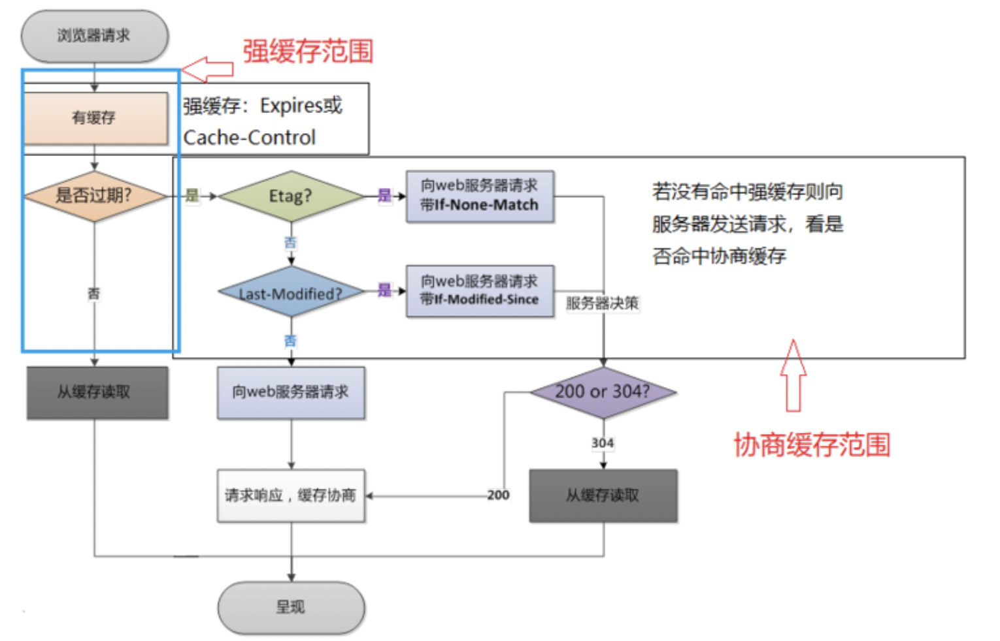

### :open_book: 浏览器

#### 浏览器工作原理？

浏览器是一种典型的客户端应用程序，其浏览器工作的基本原理如下：

> URL解析-DNS查询-TCP连接-处理请求-接受响应-渲染页面
>
> 1. **用户输入并解析URL**: 用户在浏览器地址栏输入URL（统一资源定位符）时，浏览器会将该URL转换为IP地址（DNS查询，例如：[www.example.com](http://www.example.com/) -> 93.184.216.34），以便将请求发送到正确的服务器（该过程会查看是否有本地缓存）
>
>    > + DNS解析原理
>    > + 网络层原理
>
> 2. **建立连接：**一旦浏览器知道服务器的IP地址，它会使用TCP协议建立与服务器的连接。
>
>    > + 网络层原理
>    > + 传输层原理
>
> 3. **发送请求：**一旦连接建立，浏览器将发送一个HTTP/HTTPS请求到服务器，请求特定的资源（例如HTML文件、图像文件等）。
>
>    > + 应用层原理：http协议的请求步骤
>    > + 如何确保数据安全可靠传输
>
> 4. **接收响应：**服务器接收到请求后，会返回一个HTTP/HTTPS响应，其中包含请求资源的内容和元数据（例如响应状态码、头信息等）。
>
>    > + 响应请求的原理
>
> 5. **解析HTML：**一旦浏览器收到响应，它会将响应内容解析为HTML，CSS和JavaScript等各种格式的数据。
>
>    > + 编译原理：词法分析、语法分析和构建DOM树和css树
>
> 6. **构建DOM树/CSSOM树：**浏览器使用解析的HTML构建DOM（文档对象模型）树，它表示了页面的层次结构。
>
>    > + 使用html构建dom树/css构建cssOM树
>
> 7. **渲染页面：**一旦DOM树构建完成，浏览器会使用CSS对其进行样式化，然后将其渲染到屏幕上。
>
>    > + 构建渲染渲染树
>    > + 理解重绘和重排的概念
>
> 8. **执行JavaScript：**如果HTML中包含JavaScript代码，浏览器将执行该代码，并在DOM树中进行修改或添加。
>
>    > + js引擎原理
>
> 9. **处理用户输入：**浏览器还负责处理用户输入，例如单击链接或提交表单等操作。
>
>    > + 异步请求等等
>
> 10. **存储缓存：**浏览器还可以将页面内容缓存到本地，以便在下次访问相同页面时更快地加载内容。
>
>     > + 浏览器缓存等等
>
> 浏览器还有很多复杂的细节和特性，如HTTP缓存、Cookie管理、跨站点脚本攻击（XSS）防护等。

#### 浏览器进程结构

> 浏览器是个多进程结构
>
> 1. **浏览器主进程：**控制除标签页外的用户界面，包括地址，书签，后退，前进按钮等，以及负责与浏览器其他进程负责协调工作
> 2. **缓存进程**：对浏览器的缓存进行管理
> 3. **网络进程：**发起网络请求 
> 4. **渲染器进程：**渲染 Tab  有可能会为每个标签页是一个渲染进程
> 5. **GPU进程：**渲染，加速栅格化生成 
> 6. **插件进程：**内置插件

#### 渲染进程

> 下面说下渲染进程的过程
>
> 1. 浏览器通过网络请求后获取html数据，通过tcp传给渲染器进程
> 2. DOM - 主线程将html解析构造DOM树
> 3. style - 样式计算
> 4. layoutTree - dom+style 根据dom树和样式生成layoutTree
> 5. paint -绘制  通过遍历 Layout Tree生成绘制顺序表
> 6. laryer - 布局  然后根据主进程将layoutTree 和绘制信息表传给合成器线程
> 7. 合成器线程  - 将得到的信息分图层分成更小的图块
> 8. 栅格线程    -    将更小的图块进行栅格化raster，返还给合成器线程draw quads图块信息  存储在GPU中
> 9. frame 合成器将栅格线程返回的图块合成帧交给浏览器进程
> 10. 浏览器进程  收到一帧的图像后传给GPU进行渲染

#### 浏览器线程

> 浏览器中的线程通常可以分为以下几类：
>
> 1. UI线程（User Interface thread）：这个线程负责处理用户界面操作，例如处理鼠标点击、键盘输入、窗口调整等。
> 2. JS线程（JavaScript thread）：这个线程负责执行JavaScript代码，并处理JavaScript引擎的事件循环。
> 3. 渲染线程（Rendering thread）：这个线程负责将HTML、CSS和JavaScript转换为可视化的网页元素，并渲染到屏幕上。
> 4. 后台线程（Background thread）：这个线程负责处理后台任务，例如网络请求、数据库操作、定时器等。
> 5. 定时器线程（Timer thread）：这个线程负责处理JavaScript定时器的触发事件。
> 6. 工作线程（Worker thread）：这个线程负责处理Web Worker的任务，这些任务通常是在后台执行的较为耗时的操作。
> 7. GPU线程（GPU thread）：这个线程负责处理GPU相关的操作，例如图形渲染、图像合成等。

#### JS执行原理？

> 1. **词法分析：**JavaScript 引擎会将 JavaScript 代码分解成一个个词法单元，如变量名、函数名、操作符等。
> 2. **语法分析：**JavaScript 引擎会将词法单元转化成语法树，根据语法规则进行语法分析，判断代码是否符合语法规则。
> 3. **编译：**JavaScript 引擎将语法树编译成字节码。
> 4. **解释执行：**JavaScript 引擎（调用操作系统）将字节码解释成机器码，并执行代码。

#### JS单线程机制？

> JavaScript 是一种单线程的脚本语言，**只有一个主线程来处理所有的任务**，同一时间只能执行一个任务，其他任务就必须等待（**优点：**在于可以避免线程同步的问题，简化了程序的设计和实现；**缺点：**无法充分利用多核 CPU，以及某个任务阻塞会导致整个线程被阻塞等）
>
> 1. **任务队列：**JavaScript 引擎会将任务分为两类：同步任务和异步任务；同步任务会立即执行，而异步任务则会被放入任务队列中，等待执行。
> 2. **事件循环：**JavaScript 引擎会不断地循环检查任务队列，如果任务队列中有任务，则会将任务取出并执行。如果任务队列为空，则 JavaScript 引擎会等待任务的到来，直到有任务时再继续执行。
> 4. **非阻塞 I/O：**当执行一个 I/O 操作时，JavaScript 引擎会将其放入任务队列中，并在完成I/O操作之后，将回调函数放回回调队列，等待其他事件执行完毕之后在执行I/O对应的回调函数
>
> JS引擎中使用event loop事件循环机制来管理任务队列，其中包括宏任务队列、微任务队列、和事件循环队列
>
> **事件循环队列：**是浏览器或者node.js环境下的一种任务，用于存放事件，比如鼠标点击和键盘输入等，事件会在对应的dom元素上进行触发然后添加到事件队列中等待处理
>
> **宏任务队列：**用于存放主线程中执行的异步任务，包括定时器任务、i/o操作和ui渲染等；
>
> **微任务队列：**用于存放当前任务执行完毕之后立即执行的异步任务，包括promise回调、async/await等
>
> 事件循环队列可以看成一种特殊的宏任务队列，宏任务队列和事件循环队列没有绝对有执行顺序优先级
>
> js主线程总的来说，执行顺序是先执行宏任务，在执行微任务（宏任务和微任务的添加顺序是不一定的），**在执行完一个宏任务之后，会立即执行所有的微任务，然后再执行下一个宏任务**
>
> ==异步操作会先被放入事件循环的异步队列中，当异步操作完成时，其对应的回调函数会被放入回调队列中等待执行==。当主线程执行完任务队列中的所有同步任务后，就会去检查异步队列中是否有任务可执行，如果有则在其异步操作完成之后，将其对应的回调函数放入回调队列中等待执行，这个过程就是事件循环。因此，异步操作和其回调函数虽然都和任务队列有关，但是它们分别属于不同的队列。

#### JS异步方式？

> JavaScript 是一门基于事件驱动的编程语言，异步方式：
>
> 1. **回调函数：**回调函数是 JavaScript 中实现异步编程最常用的方式。在异步操作完成后，JavaScript 引擎会调用相应的回调函数来处理操作结果-回调地狱问题
> 2. **Promise：**Promise 是一种解决回调函数嵌套的问题的机制。它通过链式调用的方式，将多个异步操作组合在一起，形成一个异步操作序列，从而避免了回调函数嵌套的问题。
> 3. **async/await：**async/await 是 ES2017 中引入的新特性，它可以使异步代码的编写更加简单和易读。async/await 基于 Promise 实现，通过使用 async 关键字定义异步函数，以及使用 await 关键字等待异步操作的结果，使得异步代码的编写更加类似于同步代码。

#### 浏览器缓存

> 浏览器缓存，就是将一个已经请求过的web资源（如js、html、图片等数据）拷贝存储在浏览器中
>
> 强制缓存
>
> > 不向服务器发送请求，直接本地取副本
> >
> > 取决于cache-control的取值
>
> 协商缓存
>
> >  想向服务器询问资源是否过期/更新，解决强制缓存的情况下，资源不更新的问题
> >
> > cache-control的取值设置为-no-cache
> >
> > last- modify的值时资源的最后修改的时间
> >
> > Etag资源时资源文件对应的hash值
>
> 1. 降低服务器压力
> 2. 减少网络宽带消耗
> 3. 减少延迟
>
> **Cookie：** 由于http协议的无状态性，cookie用于记录和保存用户的行为状态，如判断用户是否已经登录、上一次访问到网页那个区域等等，方便网页更加个性化的推荐（有效期内一直有效）
>
> sessionStorage在网页刷新后快速显示页面（页面关闭之后无效），localStorage在系统意外关机后快速加载页面（始终有效）
>
> [cookie、session和token区别](https://juejin.cn/post/6844904034181070861)
>
> [cookie、session和token区别](https://segmentfault.com/a/1190000017831088)

[浏览器缓存](https://segmentfault.com/a/1190000039818426)

#### 缓存技术

> 代理缓存、浏览器缓存、网关缓存和负载均衡和内容分发网络等等

#### 调试工具

>  [B站浏览器调试工具](https://www.bilibili.com/video/BV1KM4y1G7EF/?spm_id_from=333.337.search-card.all.click&vd_source=084728306193898208d80f40ece2975b)

