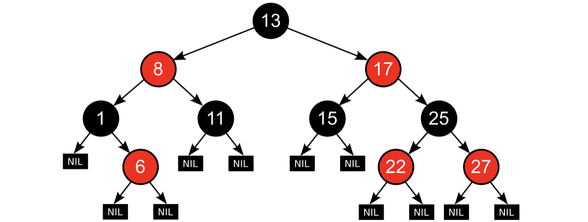
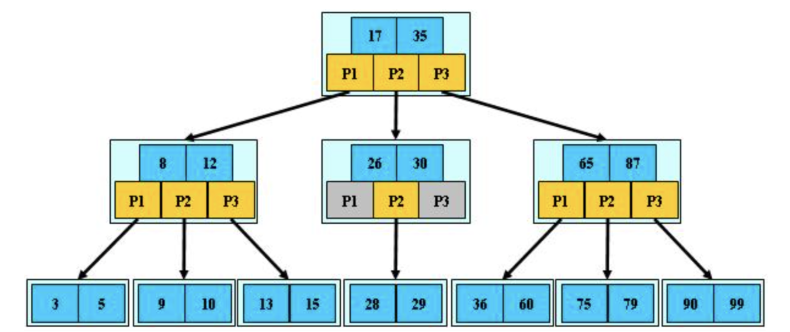
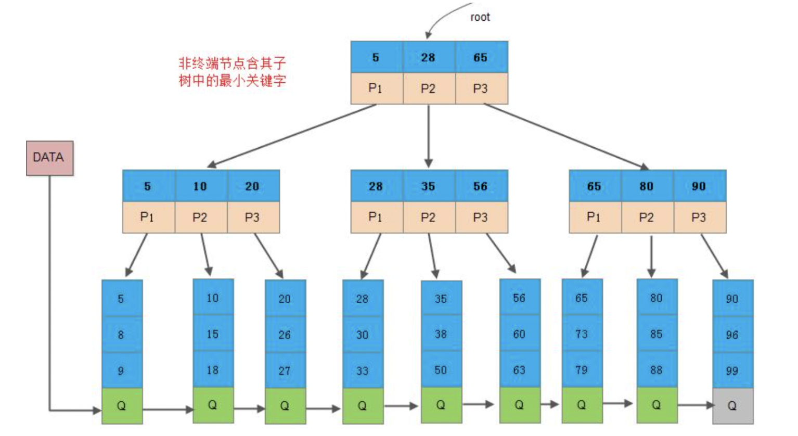
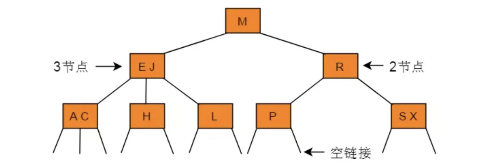

### :pen: 线性表

#### 静态数组

静态数组大小是在编译期间就确定的并分配好的，内存使用在计算机程序运行结束后自动释放，效率高

#### 动态数组

动态数组是程序运行时，程序员根据实际需要从堆中动态申请的，使用结束后由程序员进行释放

#### 单链表

链式存储的数据结构，采用一组任意地址存储单元存放线性表中的数据元素

**操作应用**

1. 单链表的插入与删除
2. 单链表的反转
3. 两条有序单链表合并成一条有序单链表

#### 双链表

每个节点包含了前后指针

**操作应用**

1. 双链表的插入与删除

#### 循环链表

最后一个节点的rear指针指向头节点

**操作应用**

1. 循环节点的插入与删除
2. 约瑟夫环

### 栈

#### 普通栈

运算受限的线性表，分为栈顶与栈底，栈底封口，栈顶开口，遵循“先进后出”的原则

#### 单调栈

每次新元素进栈，栈内元素保持有序

### 队列

#### 普通队列

运算受限的线性表，分为队头和队尾，队头取元素，队尾插入元素，遵循“先进先出”的原则

**循环队列：**将队列的存储空间最后一个位置绕道第一个位置，形成逻辑上的环形

#### 双端队列

元素可以从两端弹出也可以从两端删除的队列

#### 阻塞队列

一个支持两个附加操作的队列

1. 队列为空时，获取元素的线程等待队列变为非空
2. 队列为满时，存储元素的线程等待队列变为可用

### 二叉树

每个节点最多两个子节点

#### 二叉查找树

假定树的所有节点值是独一无二的

1. 左子树节点值>根节点值
2. 右子树节点值<根节点值

#### 平衡二叉树（AVL树）

1. 可以是一棵空树
2. ||任意节点左右子树高度之差||<=1

#### 平衡二叉树（红黑树）

1. 每个节点是黑色或红色
2. 根节点是黑色
3. 所有叶子节点（NIL）是黑色
4. 每个红色节点必须有两个黑色子节点
5. 从任一节点到每个叶子的所有简单路径都包含了相同数目的黑色节点

#### 满和完全二叉树

**满二叉树：**每一层的节点数量达到最大值

**完全二叉树：**叶子节点在最后一层按照从左至右依次排列

### 多路查找树

#### B树

能在对数时间内完成数据的查找、顺序访问、插入数据和删除动作

1. 子节点数量：
   1. 根节点：[2,M]
   2. 枝节点：[ceil(M/2),M]
2. 关键字数量取值范围：
   1. 根节点：[1,M-1]
   2. 枝节点：[M/2,M]
3. 关键字数量=指向子节点数量-1
4. 所有叶子节点均在同一层，叶子节点也有子节点指针（指向NULL）

#### B+树

非叶子节点不保存具体数据，只保存关键字的索引，最终所有的具体数据否保存在叶子节点。

[B+树详解](https://ivanzz1001.github.io/records/post/data-structure/2018/06/16/ds-bplustree)

#### 2-3树

2-3树是对二叉查找树的改进，也是一种平衡二叉树

1. 非叶子节点只能含有2个子节点或者3个子节点
2. 对于2-节点，包含一个数据和两个指针，两个节点要么都有为空，要么也是一棵2-3树（满足当前节点值大于左子树所有节点数据，小于右子树所有节点数据）
3. 对于3-节点，包含两个数据a、b和3个子节点指针，左子树节点数据小于a，中子树节点数据大于a小于b，右子树节点数据大于b

#### 2-3-4树

类似2-3树，任一非叶子节点只能含有2、3和4个子节点

1. 2-节点，包含1个元素和2个子节点
2. 3-节点，包含2个元素和3个子节点
3. 4-节点，包含3个元素和4个子节点

### 堆

#### 优先队列（二项堆）

在优先队列中，元素被赋予优先级，访问元素时，具有优先级高的元素优先被访问，优先级低的后被访问

#### 大顶堆与小顶堆

**大顶堆：**每个节点的值都大于或等于其左右孩子节点的值

**小顶堆：**每个节点的值都小于或者等于左右孩子节点的值

### 散列表

散列函数（哈希函数）是把消息或者数据进行压缩成摘要，使得数据量变小，将数据格式固定下来

#### 散列函数

将任意长度的输入值变成固定长度的输出，输出的散列值通常是数字与字母的组合

#### 散列冲突

多个值哈希到散列表同一位置产生散列冲突

**解决方法**

1. 开放寻址法

   1. 线性探索再散列
   2. 二次探索再散列
   3. 伪随机再散列

2. 再哈希法

   构建多个哈希函数，当第一个哈希函数发生冲突的采用下一个哈希函数进行哈希

3. 链地址法

   将哈希地址为同一个地址的元素构成一个同义词链表

### 位图

一种常用压缩方法，点阵图或者栅格图 
