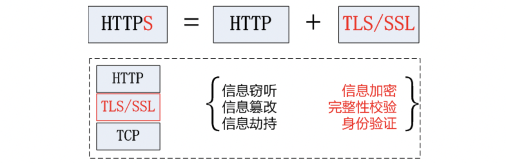
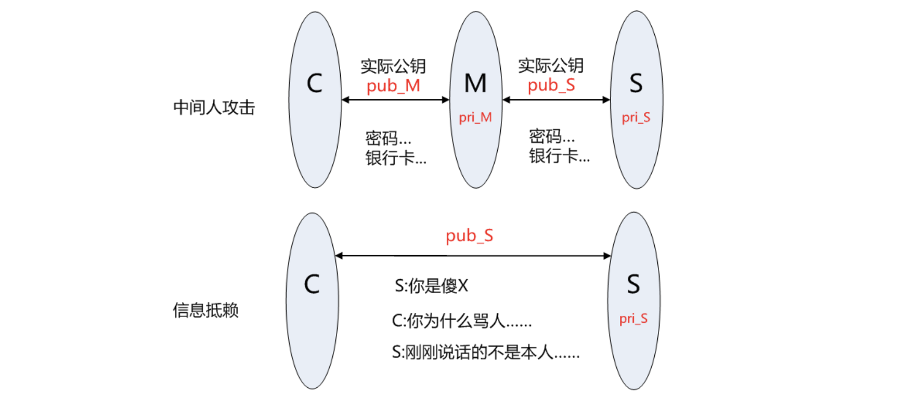

#### 基础知识

https是安全超文本传输协议，用于客户端与服务器之间交换信息的安全通道

`https=http+tls/ssl`，tls表示传输层安全，ssl表示安全套接字

采用http明文传输会导致**信息窃听、信息篡改和信息劫持**的风险，tls/ssl会对通信通道的信息进行**信息加密、完整性校验和身份验证**

#### TLS/SSL工作原理

TLS/SSL功能实现依赖于：**非对称加密、对称加密和散列函数**；非对称加密进行身份验证和密钥协商，对称加密对数据进行加密，散列函数用于验证信息的完整性

散列函数（MD5、SHA256等）只是对数据进行hash，哈希值依旧是明文，需要进行在发送端加密，接收端解密之后才知道数据是不是完整

对称加密（DES、3DES和AES等）采用相同的密钥对信息进行加密和解密

非对称加密（采用RSA），公钥+私钥，可以构建数字证书

#### PKI 公钥基础架构（Public Key Infrastructure）

单使用RSA进行身份验证是不安全的，因为公钥中并没有包含服务器的信息

会出现**中间人攻击和信息抵赖（不可否认性）**等安全问题

**身份验证CA（Certificate Authority）和证书**

解决以上的问题就是需要引入第三方机构要证明服务器的合法性和公钥获取途径的合法性，并办法颁发证书，同时提供使用者验证证书的服务，即KPI体系

CA基本原理：

1. 对关键信息利用私钥进行签名（加密）
2. 公开公钥，客户端可以利用公钥验证签名

#### TLS/SSL握手协议

1. **一次握手：**客户端发起请求，以明文传输请求信息，包含版本信息、加密套件候选列表、压缩算法候选列表、随机数和拓展字段等
2. **二次握手：**服务器响应并返回协商结果，选择使用一系列**版本和算法**，以及**服务器证书**
3. **三次握手：**客户端对服务器的和证书进行合法性验证，发送给**服务器客户端证书（服务器验证客户端合法性）**
4. **四次挥手：**客户端和服务器确定密钥
   + 客户端产生**随机数A**和证书，并用证书公钥加密，发送给服务器
   + 服务器产生随机数B，用客户端证书加密返回给客户端进行密钥协商
   + encKey=hash(A,B)计算得到，用于后面的通信
   + 结束TLS/SSL握手，开始加密通信

**会话缓存握手过程**

为了加快建立握手的速度，加少协议带来性能降低和资源消耗，tls有两种会话缓存机制：**会话标识session ID和会话记录session ticket**

会话标识session ID：

+ 如果客户端和服务器曾经建立过连接，服务器会在握手成功之后返回session ID，并保存相应的通信参数在服务器中
+ 如果客户端再次需要和服务器连接，则在**client_hello中的session ID中携带的信息会发送给服务器**
+ 服务器根据收到的session ID检索缓存记录，如果没有检索到缓存记录，按照正常握手协议进行
+ 如果检索到缓存记录，客户端和服务器互相发送加密信息并验证，合法之后则直接握手成功

#### 性能优化

在http和tcp层中间添加了tls/ssl层必然会增加信息传输的时延和消耗计算机CPU和内存资源

**优化方法：**

+ CDN 内容分发网络：减少客户端与服务器之间的传输距离，减少时延
+ 会话缓存：减少多次握手消耗的时延
+ 硬件加速：安装专用的ssl硬件加速快，类似GPU（对图形图像渲染来降低cpu的压力）
+ 远程解密：专门为web服务器配备高性能服务器用于解密

#### 参考

[https加密协议详解](https://www.wosign.com/FAQ/faq2016-0309-01.htm)

[KPI体系](https://www.wosign.com/FAQ/faq2016-0309-03.htm)
